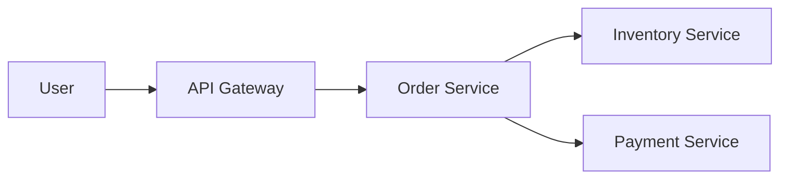

# Case Studies: Hard Level (Architectural)

### Q1: How would you design a URL shortening service like Bitly?

**Answer:**

1. **Requirements:** Shorten URL, Redirect (301/302), Custom aliases, Analytics.
2. **API:** `POST /v1/shorten {longUrl}`, `GET /{shortCode}`.
3. **Storage:** NoSQL (Key-Value) like DynamoDB or Cassandra works well because we only need simple lookups.
4. **Logic:** Use Base62 encoding on a unique counter or an MD5 hash of the original URL.

### Q2: How would you design a scalable chat system (WhatsApp/Messenger)?

**Answer:**

1. **Protocol:** WebSockets for bi-directional, real-time communication.
2. **Components:**
    * **Chat Service:** Manages connections.
    * **Presence Service:** Tracks online/offline status.
    * **Message Store:** Distributed NoSQL (Cassandra/HBase) for message history.
3. **Flow:** Use a Message Queue (Kafka) to handle message delivery and offline notifications.

### Q3: How would you design a news feed system like Twitter?

**Answer:**

1. **Fan-out on Load (Pull):** Users pull the feed when they log in (Slow for large followings).
2. **Fan-out on Write (Push):** When a user tweets, it is pushed to all followers' pre-computed feeds (Fast read, slow
   write for celebrities).
3. **Hybrid:** Use "Push" for normal users and "Pull" for celebrities with millions of followers.

### Q4: How would you design a video streaming platform (YouTube/Netflix)?

**Answer:**

1. **Storage:** S3 for raw videos.
2. **Transcoding:** A background worker converts video into multiple formats (1080p, 720p, 480p) and chunks (
   MPEG-DASH/HLS).
3. **Delivery:** CDN (Content Delivery Network) is the most critical component to reduce latency globally.

### Q5: How would you design a Distributed File Storage System (S3/HDFS)?

**Answer:**

1. **Architecture:** Use a **NameNode** (Metadata) and multiple **DataNodes** (Actual Chunks).
2. **Reliability:** Replicate each file chunk across 3 different racks to prevent data loss.
3. **Consistency:** Use a checksum for every chunk to detect data corruption.

### Q6: How would you design a Ride Sharing System (Uber/Lyft)?

**Answer:**

1. **Matching:** Use **Geohashing** or **S2 Geometry** to index drivers' locations in real-time.
2. **Latency:** Use a specialized "Map Service" for ETA calculations and routing.
3. **Storage:** Use a NoSQL database (Cassandra) for ride history and a fast Geospatial index (Redis) for active driver
   locations.

### Q7: How would you design a Payment Processing System (Stripe/PayPal)?

**Answer:**

1. **Idempotency:** This is the most critical part. Ensure that if a network retry occurs, the user isn't charged twice.
2. **Audit Log:** Every state change (Initiated -> Pending -> Completed) must be logged in an immutable ledger.
3. **Consistency:** Use a relational database with ACID properties for transactional integrity.

### Q8: How would you design an E-commerce Platform (Amazon)?

**Answer:**

1. **Microservices:** Separate services for Inventory, Cart, Order, and Catalog.
2. **Availability:** Use an "Available-to-Promise" (ATP) cache for inventory to handle high-traffic sales.
3. **Search:** Integrate Elasticsearch for fast product searching and filtering.

**Diagram Logic (Simple Flow):**

---
[⬅️ Back to Case Studies Index](./README.md) | [Home 🏠](../../README.md)