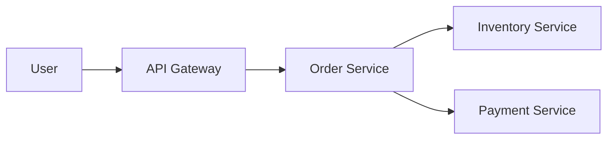
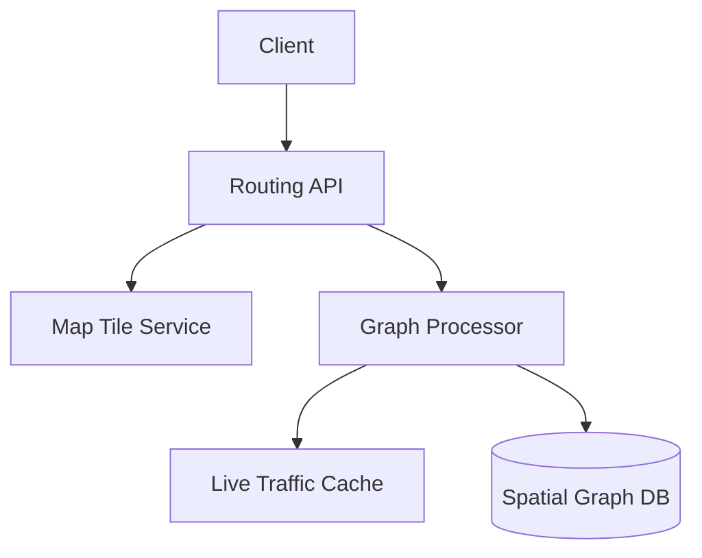

# Case Studies: Hard Level (Architectural)

### Q1: How would you design a URL shortening service like Bitly?

**Answer:**

1. **Requirements:** Shorten URL, Redirect (301/302), Custom aliases, Analytics.
2. **API:** `POST /v1/shorten {longUrl}`, `GET /{shortCode}`.
3. **Storage:** NoSQL (Key-Value) like DynamoDB or Cassandra works well because we only need simple lookups.
4. **Logic:** Use Base62 encoding on a unique counter or an MD5 hash of the original URL.

### Q2: How would you design a scalable chat system (WhatsApp/Messenger)?

**Answer:**

1. **Protocol:** WebSockets for bi-directional, real-time communication.
2. **Components:**
    * **Chat Service:** Manages connections.
    * **Presence Service:** Tracks online/offline status.
    * **Message Store:** Distributed NoSQL (Cassandra/HBase) for message history.
3. **Flow:** Use a Message Queue (Kafka) to handle message delivery and offline notifications.

### Q3: How would you design a news feed system like Twitter?

**Answer:**

1. **Fan-out on Load (Pull):** Users pull the feed when they log in (Slow for large followings).
2. **Fan-out on Write (Push):** When a user tweets, it is pushed to all followers' pre-computed feeds (Fast read, slow
   write for celebrities).
3. **Hybrid:** Use "Push" for normal users and "Pull" for celebrities with millions of followers.

### Q4: How would you design a video streaming platform (YouTube/Netflix)?

**Answer:**

1. **Storage:** S3 for raw videos.
2. **Transcoding:** A background worker converts video into multiple formats (1080p, 720p, 480p) and chunks (
   MPEG-DASH/HLS).
3. **Delivery:** CDN (Content Delivery Network) is the most critical component to reduce latency globally.

### Q5: How would you design a Distributed File Storage System (S3/HDFS)?

**Answer:**

1. **Architecture:** Use a **NameNode** (Metadata) and multiple **DataNodes** (Actual Chunks).
2. **Reliability:** Replicate each file chunk across 3 different racks to prevent data loss.
3. **Consistency:** Use a checksum for every chunk to detect data corruption.

### Q6: How would you design a Ride Sharing System (Uber/Lyft)?

**Answer:**

1. **Matching:** Use **Geohashing** or **S2 Geometry** to index drivers' locations in real-time.
2. **Latency:** Use a specialized "Map Service" for ETA calculations and routing.
3. **Storage:** Use a NoSQL database (Cassandra) for ride history and a fast Geospatial index (Redis) for active driver
   locations.

### Q7: How would you design a Payment Processing System (Stripe/PayPal)?

**Answer:**

1. **Idempotency:** This is the most critical part. Ensure that if a network retry occurs, the user isn't charged twice.
2. **Audit Log:** Every state change (Initiated -> Pending -> Completed) must be logged in an immutable ledger.
3. **Consistency:** Use a relational database with ACID properties for transactional integrity.

### Q8: How would you design an E-commerce Platform (Amazon)?

**Answer:**

1. **Microservices:** Separate services for Inventory, Cart, Order, and Catalog.
2. **Availability:** Use an "Available-to-Promise" (ATP) cache for inventory to handle high-traffic sales.
3. **Search:** Integrate Elasticsearch for fast product searching and filtering.

**Diagram Logic (Simple Flow):**



### Q9: How would you design a Distributed Logging System (ELK Stack)?

**Answer:**

1. **Collection:** Agents (Logstash/Fluentd) on servers collect logs.
2. **Buffering:** Send logs to **Kafka** to prevent the logging system from crashing during a spike.
3. **Storage/Indexing:** Index logs in **Elasticsearch** for fast searching.
4. **Visualization:** Use **Kibana** to create dashboards.

### Q10: How would you design a Content Delivery Network (CDN)?

**Answer:**

1. **Edge Locations:** Deploy proxy servers in data centers globally.
2. **Request Routing:** Use **Anycast IP** or DNS-based routing to send users to the nearest edge server.
3. **Caching Strategy:** * **Pull:** Cache on first request.
    * **Push:** Pre-warm the cache for high-traffic assets.

### Q11: How would you design a Ticket Booking System (Ticketmaster)?

**Answer:**

1. **Concurrency:** This is a "High Contention" problem. Use **Distributed Locking** (Redis Redlock) or Database
   Pessimistic Locking to ensure a seat isn't sold twice.
2. **Waiting Room:** Use a Virtual Queue (Kafka) to hold users when traffic exceeds capacity.
3. **Transactional Integrity:** Use a Relational DB (SQL) for the final payment and seat assignment to ensure ACID
   properties.

### Q12: How would you design a Distributed Job Scheduler (Quartz/Airflow)?

**Answer:**

1. **Job Store:** Store scheduled tasks in a DB with execution times.
2. **Leader Election:** Use Zookeeper to ensure only one "Scheduler Node" is active at a time to prevent duplicate
   triggers.
3. **Worker Pool:** Decouple the scheduler from workers using a Message Queue. Workers pull tasks when they are free.

### Q13: How would you design a system with Zero Downtime Deployment?

**Answer:**

1. **Blue-Green Deployment:** Run two identical environments. Route traffic to "Green" (new version); if it fails, roll
   back to "Blue" immediately.
2. **Canary Release:** Deploy the new version to 5% of users first. Monitor for errors, then scale to 100%.
3. **Rolling Updates:** Update instances one by one behind a Load Balancer.

**Deployment Strategy Logic:**

```yaml
strategy:
  type: RollingUpdate
  rollingUpdate:
    maxUnavailable: 25%
    maxSurge: 25%
```

### Q14: How would you design a Fraud Detection System?

**Answer:**

1. **Hot Path (Real-time):** Rule-based engine (e.g., "Is the transaction from a new country?") using Flink or Spark
   Streaming.
2. **Cold Path (Batch):** Machine Learning models trained on historical data to identify complex patterns.
3. **Score Service:** Returns a "Fraud Score" (0-100) to the payment gateway to allow/block the transaction.

### Q15: How would you design a Recommendation System (Netflix/Amazon)?

**Answer:** Most modern systems use a hybrid approach:

1. **Content-Based Filtering:** Recommends items similar to what a user liked before (using metadata tags).
2. **Collaborative Filtering:** Recommends items liked by similar users (User-User or Item-Item).
3. **Architecture:**
    * **Candidate Generation:** Quickly filter millions of items down to hundreds.
    * **Ranking:** Use a Machine Learning model (Neural Network) to score the remaining candidates.
4. **Storage:** Use a Vector Database (like Milvus or Pinecone) for similarity searches.

### Q16: How would you design a Real-time Analytics System (with Backpressure)?

**Answer:**

1. **Ingestion:** Use **Apache Kafka** as a buffer to decouple producers from consumers.
2. **Processing:** Use **Apache Flink** or **Spark Streaming** for windowed calculations (e.g., "count clicks in the
   last 5 minutes").
3. **Backpressure Handling:** In Flink, if a consumer is slow, it stops pulling from Kafka. Kafka stores the data until
   the consumer catches up, preventing memory overflow in the app layer.
4. **Storage:** Store results in a Time-Series Database (InfluxDB) or a Columnar Store (ClickHouse).

### Q17: How would you design a Global Distributed System across Multiple Regions?

**Answer:**

1. **Traffic Routing:** Use **Geo-DNS** (Route53) to route users to the nearest AWS Region.
2. **Data Replication:**
    * **Multi-Master:** High complexity (conflict resolution needed).
    * **Global Tables:** Use DynamoDB Global Tables for automatic multi-region replication.
3. **Content Delivery:** Use a Global CDN (CloudFront) for static and dynamic edge caching.

### Q18: How would you design a Multi-tenant SaaS Application?

**Answer:** You must choose a data isolation strategy:

1. **Silo (Database-per-tenant):** Highest isolation, most expensive, easiest to scale per user.
2. **Bridge (Schema-per-tenant):** Shared DB, separate schemas.
3. **Pool (Shared Database):** All tenants share tables. Use a `tenant_id` column and Row-Level Security (RLS) to
   prevent data leaks.
4. **Tenant Context:** Implement an Interceptor at the API Gateway to inject the `tenant_id` into the thread context.

### Q19: How would you design a system for File Upload at scale?

**Answer:**

1. **Direct Upload:** Client requests a **Pre-signed URL** from the server, then uploads directly to S3. This bypasses
   the app server, saving CPU/Bandwidth.
2. **Multipart Upload:** For large files, split them into chunks and upload in parallel.
3. **Post-Processing:** Use an S3 Event Trigger to kick off a Lambda function for virus scanning or image resizing.

### Q20: How would you design a Map Routing System (Google Maps)?

**Answer:**

1. **Data Representation:** Represent the map as a **Graph** where intersections are nodes and roads are edges.
2. **Algorithms:** Use **Dijkstra’s** or **A* Search** for shortest path calculations.
3. **Optimization:** Since global graphs are too large, use **Hierarchical Graphs** (highways vs. local roads) to speed
   up long-distance searches.
4. **Live Traffic:** Use a Stream Processing engine to update edge "weights" (travel time) based on real-time user GPS
   data.

**Mermaid Logic (Routing Request):**



---
[⬅️ Back to Case Studies Index](./README.md) | [Home 🏠](../../README.md)