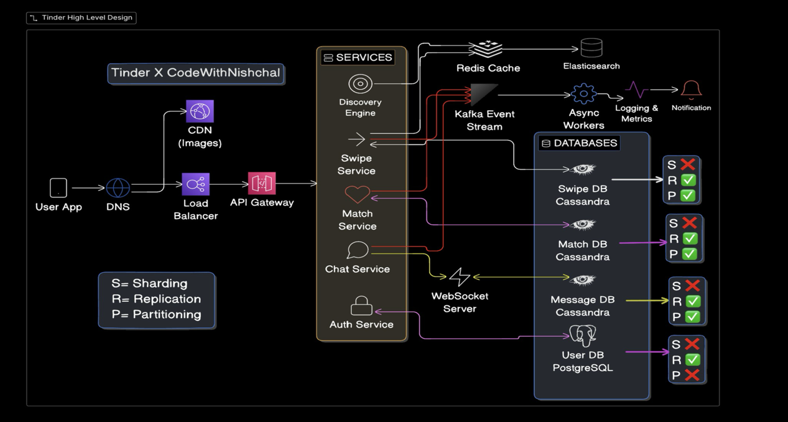

# Tinder System Design - High Level Design

This document explains in detail the architecture of a large-scale dating application like Tinder. The system must support millions of users swiping profiles, generating matches, and exchanging messages in real time.

---

---

## 1. User App
The user application is the mobile or web client used by the user where all interactions originate.
* **Actions:** Opening the app, loading nearby profiles, swiping, and sending messages.
* **Design Considerations:** Responses must be quick, network requests minimized, and real-time updates supported for chat.
* **Scalability:** The backend must scale horizontally to handle millions of concurrent users.

## 2. DNS (Domain Name System)
DNS converts human-readable domains (like tinder.com) into backend server IP addresses.
* **Importance:** Directs users to the correct server cluster and enables geographic routing to the nearest region to reduce latency.

## 3. CDN (Content Delivery Network)
A CDN stores static content, such as profile photos, across multiple global edge locations.
* **Purpose:** Images are heavy; fetching them from origin servers for every request would overload the backend.
* **Providers:** Cloudflare, AWS CloudFront, Akamai.

## 4. Load Balancer
Distributes incoming requests across multiple backend servers.
* **Benefits:** Prevents server overload, allows horizontal scaling, and improves reliability.
* **Technologies:** AWS ELB, Nginx, HAProxy.

## 5. API Gateway
Acts as the single entry point for all backend services.
* **Responsibilities:** Request routing, authentication verification, rate limiting, and request logging.
* **Tools:** Kong, AWS API Gateway, Nginx.

## 6. Discovery Engine
Determines which profiles should be shown to a user based on geographic distance, preferences, activity level, and filtering rules.
* **Technology:** **Elasticsearch** is used because it is optimized for fast search and geospatial queries (e.g., "users within 10km") that traditional relational databases struggle with at scale.

## 7. Redis Cache
Used as a high-speed, in-memory cache to reduce database load.
* **Use Cases:** Caching swipe decks, storing recent swipe history, and active session data.
* **Alternatives:** Memcached, Hazelcast.

## 8. Swipe Service
Records swipe actions (left or right).
* **Database:** **Cassandra** is used for its high write throughput and ability to handle millions of swipes per minute.

## 9. Match Service
Checks if two users have both swiped right on each other.
* **Database:** **Cassandra** is used here as well to store massive match datasets while maintaining fast reads.

## 10. Chat Service and WebSocket
Messaging requires real-time communication provided by WebSockets, which maintain persistent connections.
* **Advantages:** Instant delivery and lower latency compared to HTTP polling.
* **Storage:** Messages are stored in Cassandra due to high write volumes.

## 11. Kafka Event Stream
Used as an event streaming platform to decouple services.
* **Workflow:** When a swipe occurs, systems like match detection and notification generation react independently without slowing down the main user request.

## 12. Async Workers
These workers consume events from Kafka to perform background tasks.
* **Tasks:** Sending push notifications, updating analytics, and computing recommendation models.

## 13. Database Design Decisions
Different databases are utilized based on workload requirements:
* **User DB (PostgreSQL):** Used for structured account data requiring strong consistency.
* **Swipe/Match/Message DB (Cassandra):** Handles massive write workloads and scales horizontally.

## 14. Replication and Partitioning
* **Partitioning:** Cassandra uses partition keys to determine where data is stored across nodes.
* **Replication:** Ensures copies of data exist across multiple nodes for fault tolerance and high availability.

## 15. Logging, Monitoring, and Notifications
* **Observability:** Systems like **Prometheus** and **Grafana** track metrics (CPU, latency), while the **ELK Stack** captures logs.
* **Notifications:** Services deliver push alerts for new matches or messages.
